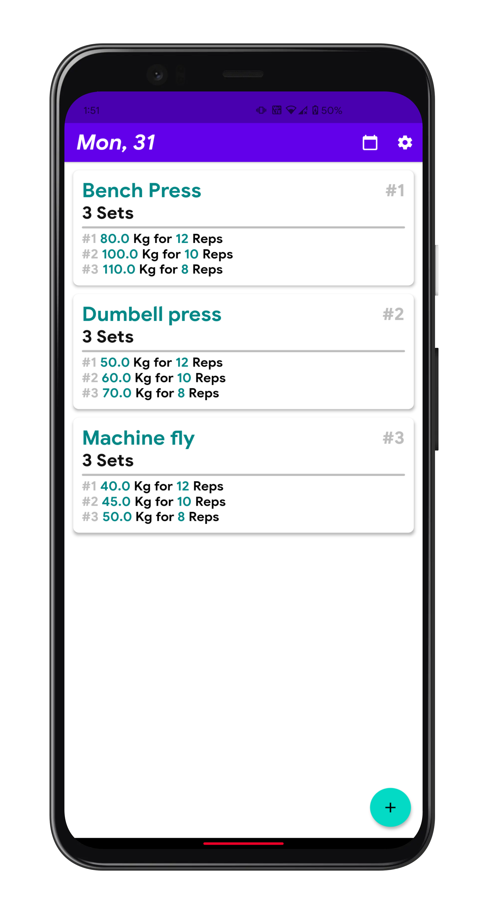
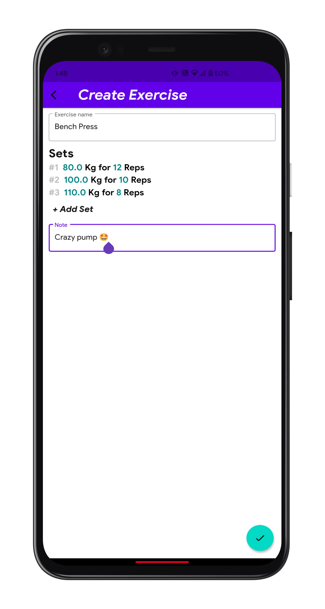
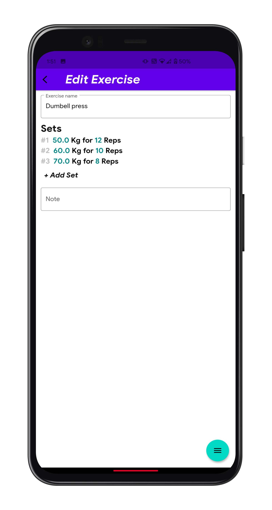
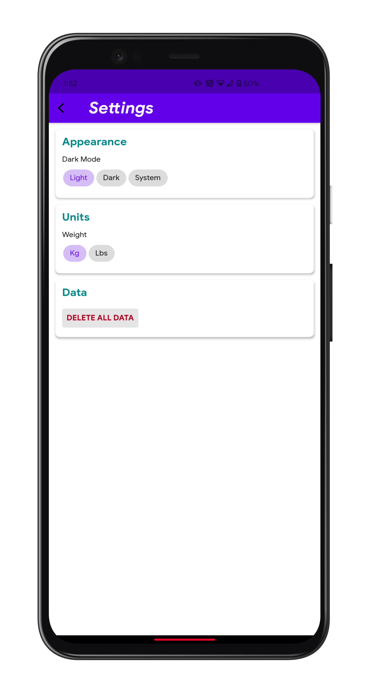
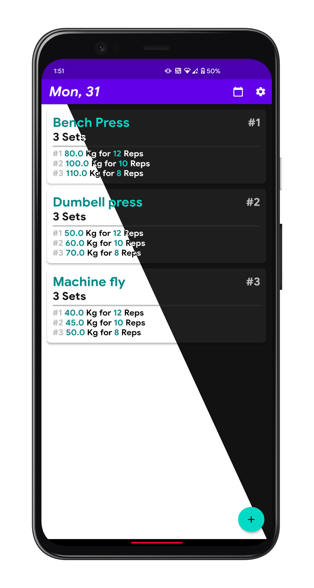

# GYM LOG

A simple app to log gym workouts.

## Screenshots

## Contributing

Found any bugs? Have any suggestions or code improvements? [Submit an issue](https://github.com/varadgauthankar/gym_log/issues) or fork and send a [pull request](https://github.com/varadgauthankar/gym_log/pulls) with your changes. All contributions are more than welcome.

## License

This project is licensed under the MIT License - see the [LICENSE](https://choosealicense.com/licenses/mit/) file for details.
